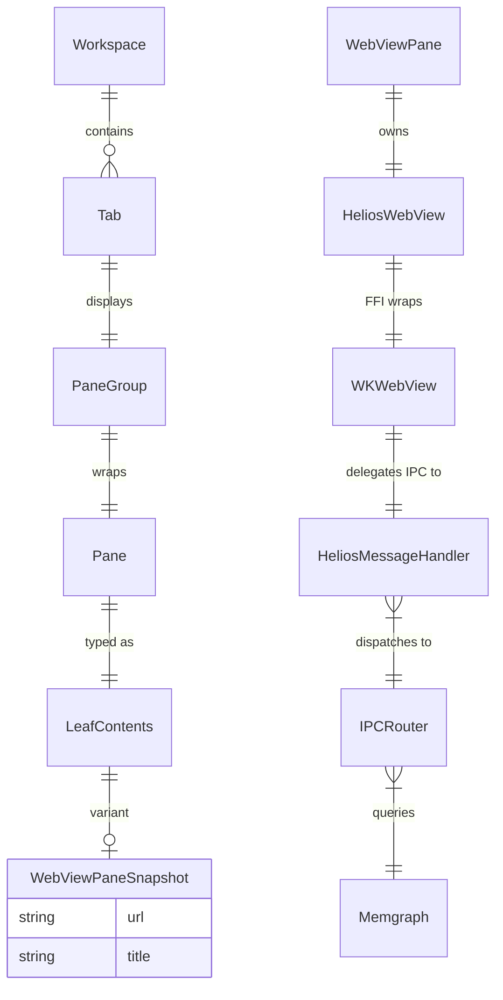

# Helios Terminal — WebView Pane Waterfall Execution Plan

> **Session goal**: Add a WKWebView pane type to Helios Terminal that enables Inbox, CRM,
> Interviews, HTML Artifacts, and all helios-desktop canvas views to render as native tabs.
>
> **Estimated execution**: 1 session (3-5 hours)
> **Prerequisites**: macOS, Xcode Command Line Tools, Memgraph running

---

## 5-Dimension Architecture

### 1. ERD (Entity-Relationship Diagram)



**Key relationships:**
- `WebViewPaneSnapshot` is a new variant of `LeafContents` enum (persisted to SQLite)
- `WebViewPane` owns a `HeliosWebView` Rust struct (runtime, not persisted)
- `HeliosWebView` wraps a native `WKWebView` via ObjC FFI
- `HeliosMessageHandler` is an ObjC delegate that routes IPC to Rust callbacks

### 2. API Matrix

| Layer | Function | Direction | Payload |
|-------|----------|-----------|---------|
| **ObjC FFI** | `helios_webview_create(frame, url)` | Rust → ObjC | NSRect, C string → id |
| **ObjC FFI** | `helios_webview_load_url(wv, url)` | Rust → ObjC | id, C string |
| **ObjC FFI** | `helios_webview_load_html(wv, html)` | Rust → ObjC | id, C string |
| **ObjC FFI** | `helios_webview_set_frame(wv, frame)` | Rust → ObjC | id, NSRect |
| **ObjC FFI** | `helios_webview_add_to_view(wv, parent)` | Rust → ObjC | id, id |
| **ObjC FFI** | `helios_webview_remove(wv)` | Rust → ObjC | id |
| **ObjC FFI** | `helios_webview_eval_js(wv, js)` | Rust → ObjC | id, C string |
| **ObjC FFI** | `helios_webview_set_ipc_callback(cb)` | Rust → ObjC | fn pointer |
| **IPC (JS→Rust)** | `window.helios.postMessage(msg)` | WebView → Rust | JSON string |
| **IPC (Rust→JS)** | `eval_js("window._heliosResponse(...)")` | Rust → WebView | JSON string |
| **Workspace** | `WorkspaceAction::OpenWebView{url,title}` | App → Workspace | String, String |
| **Workspace** | `add_tab_for_webview(title, url, ctx)` | Workspace → Tab | &str, &str |

### 3. Frontend (WebView Content)

| View | File | Data Source | IPC Messages |
|------|------|-------------|-------------|
| Inbox | `resources/webviews/inbox.html` | Memgraph Email nodes | `{type:"query", cypher:"MATCH (e:Email)..."}` |
| CRM | `resources/webviews/crm.html` | Memgraph Firm/Partner nodes | `{type:"query", cypher:"MATCH (f:Firm)..."}` |
| Interview | `resources/webviews/interview.html` | Pi interview JSON | `{type:"navigate", url:"..."}` |

**Stack**: Standalone HTML + Tailwind CDN. No bundler. Communication via `window.helios.postMessage()` / `window._heliosResponse()`.

### 4. Backend (Rust + ObjC)

| Component | File | Responsibility |
|-----------|------|---------------|
| `webview.h` / `webview.m` | `crates/warpui/src/platform/mac/objc/` | ObjC WKWebView lifecycle + IPC delegate |
| `webview.rs` | `crates/warpui/src/platform/mac/` | Safe Rust wrapper over FFI |
| `build.rs` | `crates/warpui/` | Compile ObjC, link WebKit.framework |
| `app_state.rs` | `app/src/` | `LeafContents::WebView` variant + snapshot |
| `webview_pane.rs` | `app/src/pane_group/pane/` | Pane trait impl (Entity, View) |
| `view.rs` | `app/src/workspace/` | `add_tab_for_webview()` |
| `mod.rs` | `app/src/workspace/` | `WorkspaceAction::OpenWebView` + menu items |

### 5. Integration Points

| Integration | From | To | Protocol | Risk |
|-------------|------|-----|----------|------|
| ObjC→Rust FFI | `webview.m` | `webview.rs` | C ABI (extern "C") | Low — matches existing alert/window pattern |
| Rust→ObjC calls | `HeliosWebView` methods | `webview.h` functions | C ABI | Low |
| WebView→Rust IPC | JS `postMessage` | `handle_ipc_message` callback | JSON over WKScriptMessageHandler | Medium — async, needs error handling |
| Rust→WebView IPC | `eval_js()` | JS `_heliosResponse` | JavaScript evaluation | Medium — string escaping |
| WebView→Memgraph | IPC router | Memgraph broker | Bolt via node script | Medium — latency |
| Pane→Layout | `WebViewPane` | warpui layout pass | `set_frame()` on resize | Medium — Z-ordering with Metal |
| Tab persistence | `WebViewPaneSnapshot` | SQLite (warp.sqlite) | LeafContents serde | Low — follows existing pattern |

---

## 5-Dimension Architecture

### 1. ERD (Entity-Relationship Diagram)


**Key relationships:**
- `WebViewPaneSnapshot` is a new variant of `LeafContents` enum (persisted to SQLite)
- `WebViewPane` owns a `HeliosWebView` Rust struct (runtime, not persisted)
- `HeliosWebView` wraps a native `WKWebView` via ObjC FFI
- `HeliosMessageHandler` is an ObjC delegate that routes IPC to Rust callbacks

### 2. API Matrix

| Layer | Function | Direction | Payload |
|-------|----------|-----------|---------|
| **ObjC FFI** | `helios_webview_create(frame, url)` | Rust → ObjC | NSRect, C string → id |
| **ObjC FFI** | `helios_webview_load_url(wv, url)` | Rust → ObjC | id, C string |
| **ObjC FFI** | `helios_webview_load_html(wv, html)` | Rust → ObjC | id, C string |
| **ObjC FFI** | `helios_webview_set_frame(wv, frame)` | Rust → ObjC | id, NSRect |
| **ObjC FFI** | `helios_webview_add_to_view(wv, parent)` | Rust → ObjC | id, id |
| **ObjC FFI** | `helios_webview_remove(wv)` | Rust → ObjC | id |
| **ObjC FFI** | `helios_webview_eval_js(wv, js)` | Rust → ObjC | id, C string |
| **ObjC FFI** | `helios_webview_set_ipc_callback(cb)` | Rust → ObjC | fn pointer |
| **IPC (JS→Rust)** | `window.helios.postMessage(msg)` | WebView → Rust | JSON string |
| **IPC (Rust→JS)** | `eval_js("window._heliosResponse(...)")` | Rust → WebView | JSON string |
| **Workspace** | `WorkspaceAction::OpenWebView{url,title}` | App → Workspace | String, String |
| **Workspace** | `add_tab_for_webview(title, url, ctx)` | Workspace → Tab | &str, &str |

### 3. Frontend (WebView Content)

| View | File | Data Source | IPC Messages |
|------|------|-------------|-------------|
| Inbox | `resources/webviews/inbox.html` | Memgraph Email nodes | `{type:"query", cypher:"MATCH (e:Email)..."}` |
| CRM | `resources/webviews/crm.html` | Memgraph Firm/Partner nodes | `{type:"query", cypher:"MATCH (f:Firm)..."}` |
| Interview | `resources/webviews/interview.html` | Pi interview JSON | `{type:"navigate", url:"..."}` |

**Stack**: Standalone HTML + Tailwind CDN. No bundler. Communication via `window.helios.postMessage()` / `window._heliosResponse()`.

### 4. Backend (Rust + ObjC)

| Component | File | Responsibility |
|-----------|------|---------------|
| `webview.h` / `webview.m` | `crates/warpui/src/platform/mac/objc/` | ObjC WKWebView lifecycle + IPC delegate |
| `webview.rs` | `crates/warpui/src/platform/mac/` | Safe Rust wrapper over FFI |
| `build.rs` | `crates/warpui/` | Compile ObjC, link WebKit.framework |
| `app_state.rs` | `app/src/` | `LeafContents::WebView` variant + snapshot |
| `webview_pane.rs` | `app/src/pane_group/pane/` | Pane trait impl (Entity, View) |
| `view.rs` | `app/src/workspace/` | `add_tab_for_webview()` |
| `mod.rs` | `app/src/workspace/` | `WorkspaceAction::OpenWebView` + menu items |

### 5. Integration Points

| Integration | From | To | Protocol | Risk |
|-------------|------|-----|----------|------|
| ObjC→Rust FFI | `webview.m` | `webview.rs` | C ABI (extern "C") | Low — matches existing alert/window pattern |
| Rust→ObjC calls | `HeliosWebView` methods | `webview.h` functions | C ABI | Low |
| WebView→Rust IPC | JS `postMessage` | `handle_ipc_message` callback | JSON over WKScriptMessageHandler | Medium — async, needs error handling |
| Rust→WebView IPC | `eval_js()` | JS `_heliosResponse` | JavaScript evaluation | Medium — string escaping |
| WebView→Memgraph | IPC router | Memgraph broker | Bolt via node script | Medium — latency |
| Pane→Layout | `WebViewPane` | warpui layout pass | `set_frame()` on resize | Medium — Z-ordering with Metal |
| Tab persistence | `WebViewPaneSnapshot` | SQLite (warp.sqlite) | LeafContents serde | Low — follows existing pattern |

---

## Phase 0: Setup & Verification (10 min)

### Task 0.1: Verify build environment
```bash
cd /Users/chikochingaya/helios-terminal
git checkout master && git pull origin master
cargo check -p warpui 2>&1 | tail -3   # Ensure clean compile
```

### Task 0.2: Verify framework availability
```bash
# WebKit.framework must exist
ls /System/Library/Frameworks/WebKit.framework/
# Verify ObjC compilation works
grep "compile_objc_lib" crates/warpui/build.rs
```

### Task 0.3: Create feature branch
```bash
git checkout -b helios/webview-pane
```

---

## Phase 1: ObjC WebView Wrapper (45 min)

### Task 1.1: Create `webview.h`
**File**: `crates/warpui/src/platform/mac/objc/webview.h`
**Pattern**: Match `alert.h` style

```objc
#import <AppKit/AppKit.h>
#import <WebKit/WebKit.h>

// Create a WKWebView with IPC message handler, return as id
id helios_webview_create(NSRect frame, const char* initial_url);

// Load a URL
void helios_webview_load_url(id webview, const char* url);

// Load HTML string
void helios_webview_load_html(id webview, const char* html);

// Set frame (reposition/resize)
void helios_webview_set_frame(id webview, NSRect frame);

// Add as subview of a parent NSView
void helios_webview_add_to_view(id webview, id parent_view);

// Remove from parent
void helios_webview_remove(id webview);

// Execute JavaScript
void helios_webview_eval_js(id webview, const char* js);

// Set the IPC callback (Rust function pointer)
typedef void (*helios_webview_ipc_callback)(const char* message);
void helios_webview_set_ipc_callback(helios_webview_ipc_callback callback);
```

### Task 1.2: Create `webview.m`
**File**: `crates/warpui/src/platform/mac/objc/webview.m`
**Pattern**: ObjC implementation with WKScriptMessageHandler delegate

```objc
#import "webview.h"

// Global IPC callback pointer (set from Rust)
static helios_webview_ipc_callback _ipc_callback = NULL;

// Message handler delegate
@interface HeliosMessageHandler : NSObject <WKScriptMessageHandler>
@end

@implementation HeliosMessageHandler
- (void)userContentController:(WKUserContentController *)controller
      didReceiveScriptMessage:(WKScriptMessage *)message {
    if (_ipc_callback && [message.body isKindOfClass:[NSString class]]) {
        const char* body = [(NSString*)message.body UTF8String];
        _ipc_callback(body);
    }
}
@end

static HeliosMessageHandler* _handler = nil;

id helios_webview_create(NSRect frame, const char* initial_url) {
    WKWebViewConfiguration* config = [[WKWebViewConfiguration alloc] init];
    
    // Set up IPC message handler
    _handler = [[HeliosMessageHandler alloc] init];
    [config.userContentController addScriptMessageHandler:_handler name:@"helios"];
    
    // Inject IPC bridge script
    NSString* bridge = @"window.helios = { postMessage: function(msg) { "
                        "window.webkit.messageHandlers.helios.postMessage("
                        "typeof msg === 'string' ? msg : JSON.stringify(msg)); } };";
    WKUserScript* script = [[WKUserScript alloc]
        initWithSource:bridge
        injectionTime:WKUserScriptInjectionTimeAtDocumentStart
        forMainFrameOnly:YES];
    [config.userContentController addUserScript:script];
    
    // Enable developer tools in debug builds
    #ifdef DEBUG
    [config.preferences setValue:@YES forKey:@"developerExtrasEnabled"];
    #endif
    
    WKWebView* webview = [[WKWebView alloc] initWithFrame:frame configuration:config];
    
    // Load initial URL if provided
    if (initial_url) {
        NSString* urlStr = [NSString stringWithUTF8String:initial_url];
        if ([urlStr hasPrefix:@"file://"]) {
            NSURL* url = [NSURL URLWithString:urlStr];
            NSURL* dir = [url URLByDeletingLastPathComponent];
            [webview loadFileURL:url allowingReadAccessToDirectory:dir];
        } else {
            NSURL* url = [NSURL URLWithString:urlStr];
            NSURLRequest* req = [NSURLRequest requestWithURL:url];
            [webview loadRequest:req];
        }
    }
    
    return webview;
}

void helios_webview_load_url(id webview, const char* url) {
    NSString* urlStr = [NSString stringWithUTF8String:url];
    NSURL* nsurl = [NSURL URLWithString:urlStr];
    if ([urlStr hasPrefix:@"file://"]) {
        NSURL* dir = [nsurl URLByDeletingLastPathComponent];
        [(WKWebView*)webview loadFileURL:nsurl allowingReadAccessToDirectory:dir];
    } else {
        NSURLRequest* req = [NSURLRequest requestWithURL:nsurl];
        [(WKWebView*)webview loadRequest:req];
    }
}

void helios_webview_load_html(id webview, const char* html) {
    NSString* htmlStr = [NSString stringWithUTF8String:html];
    [(WKWebView*)webview loadHTMLString:htmlStr baseURL:nil];
}

void helios_webview_set_frame(id webview, NSRect frame) {
    [(WKWebView*)webview setFrame:frame];
}

void helios_webview_add_to_view(id webview, id parent_view) {
    [(NSView*)parent_view addSubview:(WKWebView*)webview];
}

void helios_webview_remove(id webview) {
    [(WKWebView*)webview removeFromSuperview];
}

void helios_webview_eval_js(id webview, const char* js) {
    NSString* jsStr = [NSString stringWithUTF8String:js];
    [(WKWebView*)webview evaluateJavaScript:jsStr completionHandler:nil];
}

void helios_webview_set_ipc_callback(helios_webview_ipc_callback callback) {
    _ipc_callback = callback;
}
```

### Task 1.3: Update build.rs
**File**: `crates/warpui/build.rs` — in `compile_objc_lib()`

Add:
```rust
println!("cargo:rustc-link-lib=framework=WebKit");
println!("cargo:rerun-if-changed=src/platform/mac/objc/webview.h");
println!("cargo:rerun-if-changed=src/platform/mac/objc/webview.m");
```

Add to `cc::Build::new()`:
```rust
.file("src/platform/mac/objc/webview.m")
```

### Task 1.4: Verify ObjC compilation
```bash
cargo build -p warpui 2>&1 | tail -5
```

---

## Phase 2: Rust FFI Bridge (30 min)

### Task 2.1: Create `webview.rs`
**File**: `crates/warpui/src/platform/mac/webview.rs`

```rust
use cocoa::base::id;
use cocoa::foundation::NSRect;
use std::ffi::{CStr, CString};
use std::os::raw::c_char;

// FFI declarations matching webview.h
extern "C" {
    fn helios_webview_create(frame: NSRect, initial_url: *const c_char) -> id;
    fn helios_webview_load_url(webview: id, url: *const c_char);
    fn helios_webview_load_html(webview: id, html: *const c_char);
    fn helios_webview_set_frame(webview: id, frame: NSRect);
    fn helios_webview_add_to_view(webview: id, parent_view: id);
    fn helios_webview_remove(webview: id);
    fn helios_webview_eval_js(webview: id, js: *const c_char);
    fn helios_webview_set_ipc_callback(callback: extern "C" fn(*const c_char));
}

/// Safe wrapper around WKWebView
pub struct HeliosWebView {
    native: id,
}

impl HeliosWebView {
    pub fn new(frame: NSRect, url: Option<&str>) -> Self {
        let c_url = url.map(|u| CString::new(u).unwrap());
        let ptr = c_url.as_ref().map(|c| c.as_ptr()).unwrap_or(std::ptr::null());
        let native = unsafe { helios_webview_create(frame, ptr) };
        Self { native }
    }

    pub fn load_url(&self, url: &str) {
        let c_url = CString::new(url).unwrap();
        unsafe { helios_webview_load_url(self.native, c_url.as_ptr()) };
    }

    pub fn load_html(&self, html: &str) {
        let c_html = CString::new(html).unwrap();
        unsafe { helios_webview_load_html(self.native, c_html.as_ptr()) };
    }

    pub fn set_frame(&self, frame: NSRect) {
        unsafe { helios_webview_set_frame(self.native, frame) };
    }

    pub fn add_to_view(&self, parent: id) {
        unsafe { helios_webview_add_to_view(self.native, parent) };
    }

    pub fn remove(&self) {
        unsafe { helios_webview_remove(self.native) };
    }

    pub fn eval_js(&self, js: &str) {
        let c_js = CString::new(js).unwrap();
        unsafe { helios_webview_eval_js(self.native, c_js.as_ptr()) };
    }

    pub fn native_id(&self) -> id {
        self.native
    }
}

impl Drop for HeliosWebView {
    fn drop(&mut self) {
        self.remove();
    }
}

/// Set the global IPC callback
pub fn set_ipc_callback(callback: extern "C" fn(*const c_char)) {
    unsafe { helios_webview_set_ipc_callback(callback) };
}
```

### Task 2.2: Register module
**File**: `crates/warpui/src/platform/mac/mod.rs` — add `pub mod webview;`

### Task 2.3: Verify Rust FFI
```bash
cargo check -p warpui 2>&1 | tail -5
```

---

## Phase 3: Pane Type Integration (60 min)

### Task 3.1: Add LeafContents::WebView
**File**: `app/src/app_state.rs`

Add to `LeafContents` enum:
```rust
WebView(WebViewPaneSnapshot),
```

Add struct:
```rust
#[derive(Clone, Debug, PartialEq)]
pub struct WebViewPaneSnapshot {
    pub url: String,
    pub title: String,
}
```

Update `is_persisted()` to include `LeafContents::WebView(_) => true`.

### Task 3.2: Add IPaneType::WebView
**File**: `app/src/pane_group/pane/mod.rs`

Add `WebView` to `IPaneType` enum and `Display` impl.

### Task 3.3: Create WebViewPane
**File**: `app/src/pane_group/pane/webview_pane.rs` (NEW)

```rust
pub struct WebViewPane {
    url: String,
    title: String,
    webview: Option<warpui::platform::mac::webview::HeliosWebView>,
}

impl WebViewPane {
    pub fn new(url: String, title: String) -> Self {
        Self { url, title, webview: None }
    }
}

// Implement Entity, View traits matching other panes (e.g., welcome_pane.rs pattern)
```

### Task 3.4: Wire into PaneGroup
Add the pane to the pane creation/rendering pipeline. Follow the pattern from `get_started_pane.rs` (simplest existing pane).

### Task 3.5: Verify pane type compiles
```bash
cargo check -p warp 2>&1 | tail -5
```

---

## Phase 4: Tab Creation & Menu Wiring (30 min)

### Task 4.1: Add workspace actions
**File**: `app/src/workspace/mod.rs`

Add to `WorkspaceAction`:
```rust
OpenWebView { url: String, title: String },
OpenInbox,
OpenCRM,
```

### Task 4.2: Add `add_tab_for_webview`
**File**: `app/src/workspace/view.rs`

```rust
pub fn add_tab_for_webview(&mut self, title: &str, url: &str, ctx: &mut ViewContext<Self>) {
    let panes_layout = PanesLayout::Snapshot(Box::new(PaneNodeSnapshot::Leaf(LeafSnapshot {
        is_focused: true,
        custom_vertical_tabs_title: None,
        contents: LeafContents::WebView(WebViewPaneSnapshot {
            url: url.to_string(),
            title: title.to_string(),
        }),
    })));
    self.add_tab_with_pane_layout(panes_layout, Arc::new(HashMap::new()), None, ctx);
}
```

### Task 4.3: Add menu items
**File**: `app/src/workspace/mod.rs` — in menu bindings

Add keyboard shortcuts / menu items for "Open Inbox" and "Open CRM".

### Task 4.4: Verify full build
```bash
cargo check -p warp 2>&1 | tail -5
```

---

## Phase 5: WebView Content Packaging (30 min)

### Task 5.1: Create minimal Inbox HTML
**File**: `app/resources/webviews/inbox.html`

Standalone HTML page that:
- Uses Tailwind CSS (CDN)
- Queries Memgraph via `window.helios.postMessage()` for inbox items
- Renders email list with triage controls
- Listens for responses via `window.addEventListener('message', ...)`

### Task 5.2: Create minimal CRM HTML
**File**: `app/resources/webviews/crm.html`

Same pattern: standalone HTML with Memgraph queries via IPC bridge.

### Task 5.3: Create interview bridge HTML
**File**: `app/resources/webviews/interview.html`

Page that renders Pi interview JSON as interactive forms.

---

## Phase 6: IPC Bridge — WebView ↔ Memgraph (45 min)

### Task 6.1: Implement IPC callback in Rust
When the WebView sends a message via `window.helios.postMessage(JSON)`:

```rust
extern "C" fn handle_ipc_message(message: *const c_char) {
    let msg = unsafe { CStr::from_ptr(message).to_str().unwrap_or("") };
    // Parse JSON: { "type": "query", "id": "xxx", "cypher": "MATCH ..." }
    // Execute via std::process::Command("node", "script/helios-graph-stats")
    // Or direct Bolt client
    // Send response back via eval_js: webview.eval_js("window._heliosResponse({...})")
}
```

### Task 6.2: Implement query routing
Route IPC messages to:
- `type: "query"` → Memgraph via node script or broker socket
- `type: "navigate"` → Load new URL in WebView
- `type: "close"` → Close tab

### Task 6.3: Wire IPC callback to WebView creation
Set the callback when the WebView pane is created.

---

## Phase 7: Build, Test, Install (20 min)

### Task 7.1: Full build
```bash
cd app && cargo bundle --bin helios-terminal 2>&1 | tail -5
```

### Task 7.2: Patch bundle
```bash
/usr/libexec/PlistBuddy -c "Set :CFBundleDisplayName 'Helios Terminal'" target/debug/bundle/osx/helios-terminal.app/Contents/Info.plist
/usr/libexec/PlistBuddy -c "Set :CFBundleName 'Helios Terminal'" target/debug/bundle/osx/helios-terminal.app/Contents/Info.plist
cp /Users/chikochingaya/familiar/apps/helios-desktop/src/assets/images/helios/helios.icns target/debug/bundle/osx/helios-terminal.app/Contents/Resources/helios-terminal.icns
```

### Task 7.3: Install and launch
```bash
pkill -f "helios-terminal" 2>/dev/null; sleep 1
rm -f ~/Library/Application\ Support/dev.helios.terminal/warp.sqlite*
rm -rf "/Applications/Helios Terminal.app"
cp -R target/debug/bundle/osx/helios-terminal.app "/Applications/Helios Terminal.app"
open "/Applications/Helios Terminal.app"
```

### Task 7.4: Verify
- Open Inbox tab (via menu or keyboard shortcut)
- Open CRM tab
- Verify IPC bridge works (queries reach Memgraph, data renders)
- Verify tab can be closed, reopened, persisted across restart

---

## Phase 8: Push & Merge (10 min)

### Task 8.1: Commit, PR, merge
```bash
git add -A
git commit -m "feat: WebView pane — Inbox, CRM, and universal web content in tabs"
git push origin helios/webview-pane
gh pr create --repo helios-agi/warp --title "feat: WebView pane type — Inbox, CRM, Interviews in tabs" \
  --head helios/webview-pane --base master \
  --body "Adds WKWebView pane type. Inbox and CRM render as native tabs with Memgraph IPC bridge."
gh pr merge --repo helios-agi/warp --merge --admin <PR_NUMBER>
```

---

## Risk Register

| Risk | Mitigation | Impact |
|------|-----------|--------|
| WKWebView Z-ordering with Metal CALayer | Use `addSubview:positioned:relativeTo:` for correct layering | Medium |
| Frame sync when resizing | Hook into warpui layout pass, update WebView frame on resize events | Medium |
| IPC latency for Memgraph queries | Use async query pattern with loading states in HTML | Low |
| Memory leaks from WebView retain cycles | Ensure proper cleanup in `Drop` impl, remove message handlers | Medium |
| WebKit.framework linking breaks CI | Gate behind `#[cfg(target_os = "macos")]` | Low |
| Keyboard focus conflicts | Match wry's `performKeyEquivalent` override pattern | Medium |

---

## Dependency Graph

```
Phase 0 (Setup)
    │
    ▼
Phase 1 (ObjC) ──────────────────────┐
    │                                  │
    ▼                                  ▼
Phase 2 (Rust FFI)              Phase 5 (HTML Content)
    │                                  │
    ▼                                  │
Phase 3 (Pane Type)                    │
    │                                  │
    ▼                                  │
Phase 4 (Tab Wiring)                   │
    │                                  │
    ▼                                  ▼
Phase 6 (IPC Bridge) ◄────────────────┘
    │
    ▼
Phase 7 (Build & Test)
    │
    ▼
Phase 8 (Push & Merge)
```

**Critical path**: Phase 0 → 1 → 2 → 3 → 4 → 7
**Parallel work**: Phase 5 (HTML content) can be done alongside Phases 1-4
**Phase 6** (IPC) depends on both the Rust bridge (Phase 2) and HTML content (Phase 5)

---

## Code Samples Index (for worker reference)

| Sample | Location | Use For |
|--------|----------|---------|
| Warp ObjC pattern | `crates/warpui/src/platform/mac/objc/alert.h/.m` | Header/impl file structure |
| Warp build.rs | `crates/warpui/build.rs:compile_objc_lib()` | Adding .m files + framework links |
| Warp msg_send FFI | `crates/warpui/src/platform/mac/window.rs:574` | Content view access pattern |
| Warp extern C fn | `crates/warpui/src/platform/mac/window.rs:1182` | Rust ↔ ObjC callback pattern |
| wry WKWebView init | `wry/src/wkwebview/mod.rs:new_ns_view()` | Full WebView creation + config |
| wry child addSubview | `wry/src/wkwebview/mod.rs` (search "is_child") | Embedding as child vs replacing |
| wry IPC delegate | `wry/src/wkwebview/class/wry_web_view_delegate.rs` | WKScriptMessageHandler impl |
| wry parent view | `wry/src/wkwebview/class/wry_web_view_parent.rs` | Custom parent NSView |
| cacao WebViewConfig | `cacao/src/webview/config.rs` | objc v1 msg_send pattern for WKWebView |
| Warp pane trait | `app/src/pane_group/pane/mod.rs:IPaneType` | New pane type pattern |
| Warp welcome pane | `app/src/pane_group/pane/welcome_pane.rs` | Simplest pane implementation |
| Warp add_tab_for_* | `app/src/workspace/view.rs:10949` | Tab creation pattern |
| Warp LeafContents | `app/src/app_state.rs:119` | Snapshot/restore enum |
| Helios graph-stats | `script/helios-graph-stats` | Memgraph query script |
| Helios graph-driver | `familiar/.../graph-driver.ts` | Bolt client pattern |
